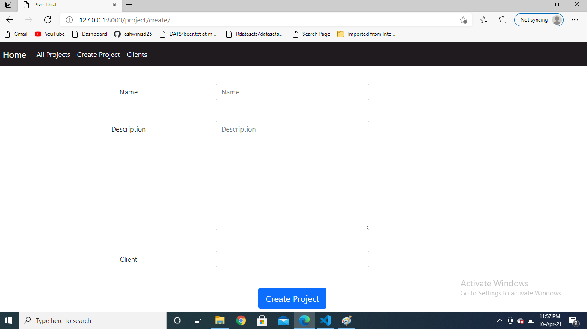
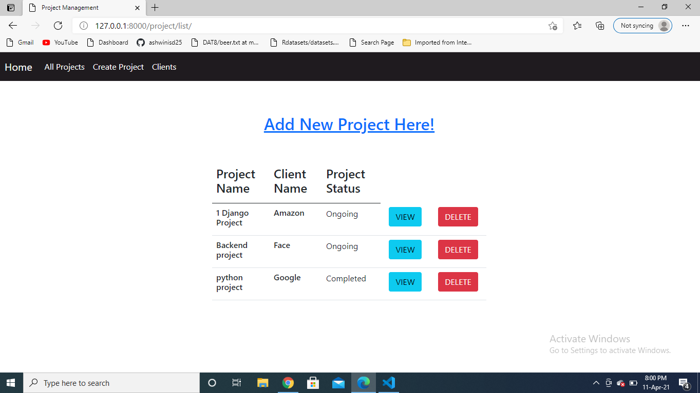
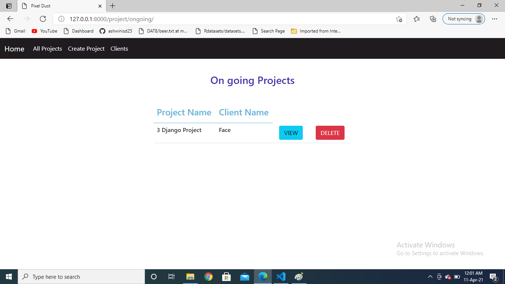
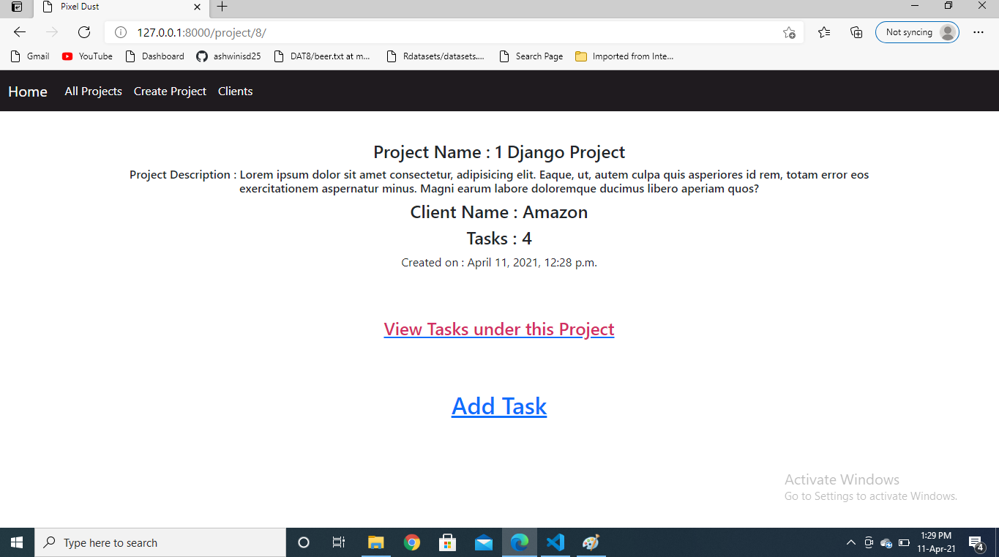
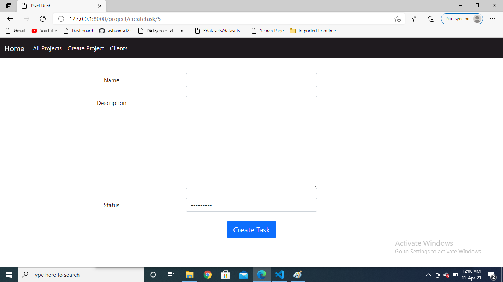
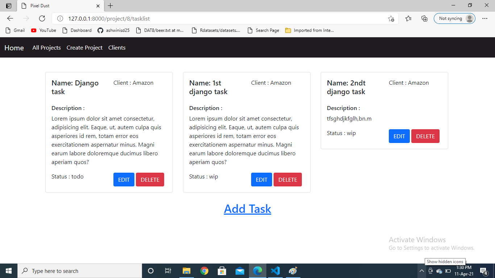
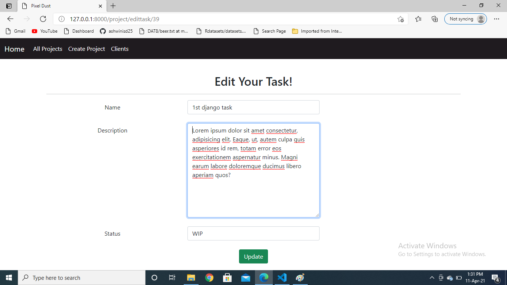

# Project-Management-System

A Simple Project Management System developedusing Python and Django.

## Features

- Simple Project management system that allows users to create a project and assign to clients. 
- Clients are added from backend admin.
- Users can choose any available client to assign their project at the time of creating a project.
- They can also view project and delete project.
- In project "n" number of tasks can be added.
- The task is created with its name, description and status(TODO, WIP, ON_HOLD, DONE).
- Task can be edited, deleted and updated.
- The users can checkout list of clients available.
- All projects are listed in all project link.
- The incomplete projects(project with no task and project with done status for all tasks in that project) are listed in OnGoing Projects.

## Requirements

The dependencies for the project are listed in requirements.txt 

#### Home page

#### All Projects List

#### Ongoing Projects List

#### Create Project

#### View Project

#### Create Task

#### Task list for a project  

#### Edit Task

